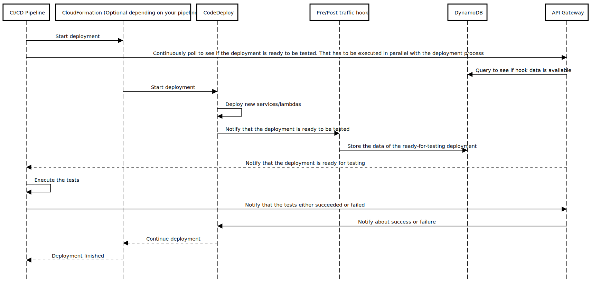

# About

The project aims to make it simpler to execute blue-green deployments in AWS using a proper
CI/CD tool, rather than a lambda to validate the deployment.

AWS uses CodeDeploy to run the blue-green deployments. Depending on how you set up your
CI/CD, CodeDeploy may be triggered by CodeBuild, CodePipeline or CloudFormation. Now matter how it
is started however, it ends up working in pretty much the same way. In order to validate the blue-green
deployment a user may choose to set up pre-traffic and/or post-traffic hooks in their CodeDeploy deployments.
Those hooks are essentially lambdas that are responsible for running basic tests on the ongoing deployment
and send a notification back to CodeDeploy letting it know whether the tests were successful or not.
CodeDeploy will the either proceed with the follow-up deployment steps or roll-back the deployment.

The issue with this standard approach is that the user is limited to what lambda can really do.
The tests have to finish within 15 minutes (maximum lambda execution time) and there are no test reports.
There are lambda logs available, but those are less than optimal for a long chain of logs produced by tests.

Introducing code-deploy-external-hook!


The approach allows to execute the tests directly from the CI/CD machine that is running the original pipeline.

1. The pipeline keeps polling the API Gateway to see if all deployments it is interested in are in the desired state
   (like for instance until all lambdas on your CloudFormation stack are ready for the pre-traffic tests)

2. The pipeline executes the tests.

3. The pipeline sends a follow-up request to API Gateway stating whether the tests were successful or not. That
   then triggers appropriate follow-up steps in CodeDeploy



# Usage

## Installation

In order to deploy, clone the project, go to its root directory and execute

```shell
$ yarn install
$ yarn build
$ yarn deploy
```

Once deployed, you can look up the stack `code-deploy-external-hook` in CloudFormation. One of its outputs is `ApiUrl`.
You'll need that to execute the API Gateway requests.

## Integrating the hooks into the deployment

The following are simple examples of how to use CodeDeploy to execute the blue-green deployment:

* [of a lambda function, using CDK](./examples/blue-green-lambda-deployment-with-cdk/lib/test-infra-stack.ts)

## REST API

### List the deployments

This is the endpoint that should be polled until it contains responses of all desired components of the application

* `CodeDeployApplicationName` - CodeDeploy application name under which the service/lambda is being deployed
* `stage` - `PRE_TRAFFIC` or `POST_TRAFFIC`. The stage that CodeDeploy is configured to verify.
* `CodeDeployDeploymentGroupName` - an array of 1 or more CodeDeploy Deployment Group Names defined under the same
   CodeDeploy application. 

POST `{ApiUrl}/deployments/{CodeDeployApplicationName}/{stage}`

```json
{
  "deploymentGroupNames": ["{CodeDeployDeploymentGroupName}"]
}
```

The response contains an empty object if none of the deployment group names are yet ready for the tests.
Otherwise, it's a map where the key is the deployment group name and the value is an object with details
necessary to submit the status of the deployment back to CodeDeploy. That is mostly used internally, but can be used
directly within your CI/CD if needed.

Example response: 

```json
{
    "deployments": {
        "myLambda": {
            "id": "myApplication:myLambda:POST_TRAFFIC",
            "deploymentId": "d-IHWDEND8F",
            "lifecycleEventHookExecutionId": "eyJlbmNyeXB0ZWREYXRhIjoiSnZFVUlmcmRRTmNNeklxMlBQRSt6ZFhaa3UvRTg3NFdNYnV0Q0ZwZElBNDlaT0owT1hsejJQSGNjd1M4em91U096TzZ5UGxuYU9zL0dVZlBaV3BGRmtKbDE2My8xS2Q1UGZCYkFMdGpLQWhmMjdlVjd2M05obno4UFFYNFNJemNCNStiMmY1WCIsIml2UGFyYW1ldGVyU3BlYyI6ImtTdVFORGQ1K094MnZKOFkiLCJtYXRlcmlhbFNldFNlcmlhbCI6MX0="
        }
    }
}
```

### Submit deployment validation result

Once all the necessary tests are executed, a request has to be sent to submit the test result that will either
allow to continue the deployment or roll it back.

DELETE `{ApiUrl}/deployments/{CodeDeployApplicationName}/{stage}`

```json
{
  "deploymentTests": { "MyCodeDeployDeploymentGroupName": "SUCCESS" }
}
```

For each of the services/lambdas that were validated, either a `SUCCESS` or `FAILURE` value has to be submitted.

On success the endpoint returns status `204 - No Content`.
